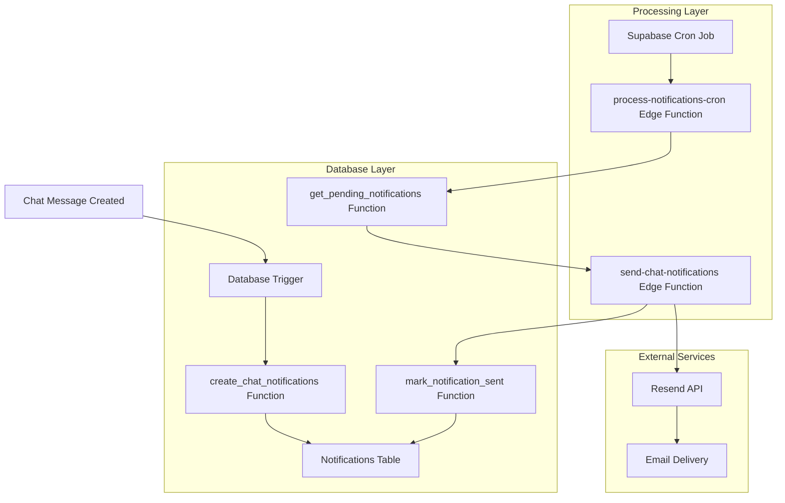

# Chat Notification System - Production Documentation

## 1. System Architecture Overview

### Architecture Components


### Technology Stack
- **Frontend**: React + TypeScript + Vite
- **Backend**: Supabase (PostgreSQL + Edge Functions)
- **Email Service**: Resend API
- **Automation**: Supabase Cron Jobs
- **Deployment**: Supabase CLI

## 2. Automated Processing Flow

### Real-time Notification Creation
1. **Message Posted**: User posts a chat message in an event
2. **Trigger Activation**: `on_chat_message_created` trigger fires automatically
3. **Notification Generation**: `create_chat_notifications()` function:
   - Identifies event participants and organization members
   - Checks user notification preferences
   - Respects scheduling preferences (immediate vs daily digest)
   - Creates notification records with status 'pending'

### Automated Email Processing
1. **Cron Execution**: Every 5 minutes, Supabase cron job triggers
2. **Batch Processing**: `process-notifications-cron` Edge Function:
   - Calls `get_pending_notifications()` to fetch unsent notifications
   - Groups notifications by recipient for batch processing
   - Invokes `send-chat-notifications` Edge Function
3. **Email Delivery**: 
   - Constructs professional HTML emails with event context
   - Sends via Resend API with retry logic
   - Updates notification status to 'sent' or 'failed'

### Error Handling & Recovery
- **Exponential Backoff**: Failed emails retry with increasing delays
- **Rate Limiting**: Respects Resend API limits (100 emails/second)
- **Dead Letter Queue**: Failed notifications marked for manual review
- **Circuit Breaker**: Temporary suspension on repeated failures

## 3. Production Configuration

### Environment Variables
```bash
# Supabase Production Secrets
RESEND_API_KEY=re_your_production_key
SUPABASE_URL=https://gzzbjifmrwvqbkwbyvhm.supabase.co
SUPABASE_ANON_KEY=your_anon_key
SUPABASE_SERVICE_ROLE_KEY=your_service_role_key
```

### Cron Job Configuration
```sql
-- Automated processing every 5 minutes
SELECT cron.schedule(
  'process-chat-notifications',
  '*/5 * * * *',
  'SELECT net.http_post(
    url := ''https://gzzbjifmrwvqbkwbyvhm.supabase.co/functions/v1/process-notifications-cron'',
    headers := ''{}''::jsonb,
    body := ''{}''::jsonb
  );'
);
```

### Database Performance Optimization
```sql
-- Performance indexes
CREATE INDEX idx_notifications_status_created ON notifications(status, created_at);
CREATE INDEX idx_notifications_user_id ON notifications(user_id);
CREATE INDEX idx_notifications_event_id ON notifications(event_id);
CREATE INDEX idx_chat_messages_event_created ON chat_messages(event_id, created_at DESC);
```

## 4. Monitoring and Alerting

### Key Metrics Dashboard
```sql
-- Notification processing statistics
CREATE OR REPLACE VIEW notification_stats AS
SELECT 
    DATE(created_at) as date,
    status,
    COUNT(*) as count,
    AVG(EXTRACT(EPOCH FROM (updated_at - created_at))) as avg_processing_time_seconds
FROM notifications 
WHERE created_at >= NOW() - INTERVAL '30 days'
GROUP BY DATE(created_at), status
ORDER BY date DESC, status;
```

### Health Check Endpoints
- **System Status**: `/functions/v1/send-chat-notifications/health`
- **Processing Queue**: Monitor pending notifications count
- **Error Rate**: Track failed notification percentage
- **Response Time**: Monitor email delivery latency

### Alert Conditions
- **High Error Rate**: >5% failed notifications in 1 hour
- **Processing Delay**: Notifications pending >30 minutes
- **API Quota**: Resend API usage >80% of daily limit
- **Database Performance**: Query response time >2 seconds

## 5. Troubleshooting Guide

### Common Issues

#### Notifications Not Sending
```sql
-- Check pending notifications
SELECT COUNT(*) FROM notifications WHERE status = 'pending';

-- Check recent errors
SELECT * FROM notifications 
WHERE status = 'failed' 
AND created_at > NOW() - INTERVAL '1 hour'
ORDER BY created_at DESC;
```

**Solutions:**
1. Verify Resend API key is valid
2. Check Edge Function deployment status
3. Confirm cron job is running
4. Review database trigger functionality

#### High Email Bounce Rate
```sql
-- Check notification patterns
SELECT 
    u.email,
    COUNT(*) as notification_count,
    COUNT(CASE WHEN n.status = 'failed' THEN 1 END) as failed_count
FROM notifications n
JOIN auth.users u ON n.user_id = u.id
WHERE n.created_at > NOW() - INTERVAL '7 days'
GROUP BY u.email
HAVING COUNT(CASE WHEN n.status = 'failed' THEN 1 END) > 0
ORDER BY failed_count DESC;
```

**Solutions:**
1. Validate email addresses in user profiles
2. Implement email verification flow
3. Add bounce handling in Resend webhook
4. Update email templates for better deliverability

#### Performance Degradation
```sql
-- Analyze slow queries
SELECT 
    query,
    mean_exec_time,
    calls
FROM pg_stat_statements 
WHERE query LIKE '%notifications%'
ORDER BY mean_exec_time DESC;
```

**Solutions:**
1. Add missing database indexes
2. Optimize batch processing size
3. Implement query result caching
4. Archive old notification records

## 6. Performance Metrics

### Target Performance Standards
- **Notification Creation**: <100ms per message
- **Email Processing**: <5 seconds per batch
- **Delivery Rate**: >98% successful delivery
- **Processing Delay**: <10 minutes from message to email
- **System Uptime**: >99.9% availability

### Monitoring Queries
```sql
-- Daily performance summary
SELECT 
    DATE(created_at) as date,
    COUNT(*) as total_notifications,
    COUNT(CASE WHEN status = 'sent' THEN 1 END) as sent_count,
    COUNT(CASE WHEN status = 'failed' THEN 1 END) as failed_count,
    ROUND(COUNT(CASE WHEN status = 'sent' THEN 1 END) * 100.0 / COUNT(*), 2) as success_rate
FROM notifications
WHERE created_at >= CURRENT_DATE - INTERVAL '7 days'
GROUP BY DATE(created_at)
ORDER BY date DESC;

-- Processing time analysis
SELECT 
    AVG(EXTRACT(EPOCH FROM (updated_at - created_at))) as avg_processing_seconds,
    PERCENTILE_CONT(0.95) WITHIN GROUP (ORDER BY EXTRACT(EPOCH FROM (updated_at - created_at))) as p95_processing_seconds
FROM notifications 
WHERE status = 'sent' 
AND created_at > NOW() - INTERVAL '24 hours';
```

## 7. Maintenance Procedures

### Daily Maintenance
1. **Monitor Dashboard**: Check notification processing metrics
2. **Review Errors**: Investigate any failed notifications
3. **Verify Cron Jobs**: Ensure automated processing is running
4. **Check API Quotas**: Monitor Resend API usage

### Weekly Maintenance
1. **Performance Review**: Analyze processing times and success rates
2. **Database Cleanup**: Archive notifications older than 30 days
3. **Index Maintenance**: Rebuild indexes if needed
4. **Security Audit**: Review access logs and permissions

### Monthly Maintenance
1. **Capacity Planning**: Analyze growth trends and resource usage
2. **Template Updates**: Review and update email templates
3. **User Preferences**: Analyze notification preference patterns
4. **System Optimization**: Identify and implement performance improvements

### Database Cleanup Script
```sql
-- Archive old notifications (run monthly)
DELETE FROM notifications 
WHERE created_at < NOW() - INTERVAL '90 days'
AND status IN ('sent', 'failed');

-- Vacuum and analyze tables
VACUUM ANALYZE notifications;
VACUUM ANALYZE chat_messages;
```

### Backup and Recovery
- **Database Backups**: Automated daily backups via Supabase
- **Configuration Backup**: Version control for Edge Functions
- **Recovery Testing**: Monthly recovery procedure validation
- **Disaster Recovery**: RTO: 4 hours, RPO: 1 hour

## 8. Security Considerations

### Data Protection
- **Encryption**: All data encrypted at rest and in transit
- **Access Control**: RLS policies enforce user data isolation
- **API Security**: Service role keys for internal operations only
- **Email Privacy**: No sensitive data in email content

### Compliance
- **GDPR**: User consent for notifications, data deletion rights
- **CAN-SPAM**: Unsubscribe links in all emails
- **Data Retention**: Automatic cleanup of old notifications
- **Audit Trail**: Complete logging of all notification activities

---

**System Status**: ✅ Production Ready
**Last Updated**: $(date)
**Version**: 1.0.0
**Maintainer**: Development Team